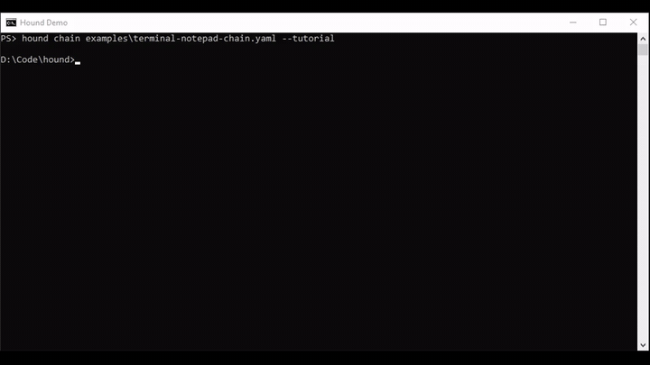

# Hound

Hound's goal is super-fast, nearly deterministic, low-cost computer use for QA of your applications.
Reusable adapters constrain each workflow to known actions and executable criteria, so an agent can
test real UI behavior with fewer model calls, less variance, and reviewable evidence.

Tell your agent: "Use Hound from [hound.clarksaben.com](https://hound.clarksaben.com) to QA your app."

Hound is a small, agent-oriented CLI and Python library for driving, inspecting, and recording an
application without taking the human's mouse, keyboard, cursor, or foreground window. On Windows it
uses [Foxhound](https://github.com/csaben/foxhound) for covered-window capture and background input.
A SystemOne decision model (JEV or CLEF) chooses one adapter-defined action per step.

[](public/hound-terminal-notepad-demo.mp4)

The embedded demo starts with the actual `hound chain` command, cuts to Notepad, types the note in
the background, burns action captions, and produces one 1280x720 H.264 tutorial. Click the GIF for
the full-resolution MP4. The validated run used no model calls because every stage had one
unambiguous next action.

Hound deliberately does not contain a general UI agent, publishing service, fixture laboratory, or
video-production suite. Its contract is: editable adapters, at most one model call per decision,
executable criteria, and a reviewable run folder.

## Agent operating contract

Use one adapter per application and edit it in place. Do not create separate adapters for tutorial
steps, owned dialogs, retries, or diagnostics. Foxhound treats an application and its owned dialogs
as one window group, routes stage-relative clicks to the correct window, and sends keys to the
topmost enabled input window. Use `hound chain` only when the workflow crosses applications.

If exactly one action is valid, Hound executes it deterministically. `driver_calls: 0` is the ideal
fast, cheap path and still means Hound ran the workflow; JEV or CLEF is reserved for real choices.
Keep exploratory artifacts in Hound's run directory, revise the same adapter after inspecting
evidence, and produce one final tutorial video.

## Install and check

```powershell
uv tool install "hound-agent @ git+https://github.com/csaben/hound.git"
hound setup --json
hound check --json
```

`hound check --json` reports separate JEV and CLEF readiness plus exact setup instructions. A fresh
base install has no cloud credentials. Deterministic steps still run because Hound calls a driver
only when two or more actions are valid.

Hound requires Python 3.11 or newer. Add the optional JEV driver with
`uv tool install --force --with "typesafe-sdk>=0.7.2" "hound-agent @ git+https://github.com/csaben/hound.git"`;
CLEF uses the core installation.

Make Codex discover and prefer Hound for native application QA:

```powershell
hound codex install                 # global skill under ~/.agents/skills/hound
hound codex install --agents        # also add a marked block to ./AGENTS.md
hound codex status --agents
```

The integration is deliberately disposable. Hound refuses to overwrite or remove an unowned skill
directory, and it edits only its marked block in `AGENTS.md`:

```powershell
hound codex remove --agents
uv tool uninstall hound-agent
```

`hound setup` downloads the pinned Windows x86_64 helper from the public Foxhound release, verifies
its SHA-256 digest, and caches it under `HOUND_HOME`. The first run also performs this bootstrap when
the helper is missing. Set `FOXHOUND_HELPER` to use a local binary, or set both
`HOUND_FOXHOUND_URL` and `HOUND_FOXHOUND_SHA256` to use another trusted build.

Set `JEV_API_KEY`/`TYPESAFE_API_KEY` for JEV, or `CLEF_URL` for a SystemOne-compatible CLEF
endpoint. Set secrets in the local environment, never in a prompt or adapter. `FOXHOUND_HELPER` can
point at a helper binary outside the adjacent Foxhound checkout.

## Agent happy path

```powershell
hound adapters search notepad --json
hound adapters add notepad
hound adapters path notepad
hound run notepad "Write a short note" --var text="Hounds are excellent." --tutorial --json
```

An adapter can always be run directly from its directory:

```powershell
hound run .\examples\notepad "Type a greeting into a new note" --var text="hello" --no-record
```

Core discovery commands:

```text
hound check
hound setup
hound adapter-schema
hound codex {install,status,remove}
hound chain CHAIN.yaml
hound adapters list
hound adapters search [QUERY]
hound adapters add NAME
hound adapters info NAME
hound adapters path NAME
hound run ADAPTER [GOAL]
```

Every command accepts `--json` before the subcommand. Installed adapters are ordinary editable files
under `~/.hound/adapters`; Hound never silently overwrites them.

## Adapter

The smallest adapter is one `adapter.yaml`:

```yaml
schema: hound.adapter/v1
name: notepad
platforms: {windows: {backend: foxhound}}

target:
  backend: foxhound
  process: notepad.exe
  launch: [notepad.exe]

driver:
  default: jev
  allowed: [jev, clef]
  image_policy: always

workflow:
  goal: Type the requested text into a new note.
  guidance:
    - Select the editor before typing.
  actions:
    - id: select_editor
      op: click
      x: 400
      y: 300
      description: Select the document editor.
      caption: Select the editor
    - id: type_text
      after: select_editor
      op: type
      text: "{{ text }}"
      description: Type the requested text.
      caption: Type the requested text
      terminal: true
  done:
    after_action: type_text
  criteria:
    - id: app_alive
      expect: Notepad remains open.
      check: builtin.target_alive
  source_refs:
    - path: src/editor.ts
      purpose: Editor behavior for an adapter-authoring agent
```

Values supplied by `--var key=value` replace `{{ key }}` in the manifest. `hooks.py` is optional and
can provide `reset(context)`, custom completion checks, criteria, or actions. Run
`hound adapter-schema --json` for the machine-readable contract.

## Evidence

Each run writes:

```text
~/.hound/runs/<adapter>/<timestamp>/
  run.json
  trace.jsonl
  recording.mp4       # when ffmpeg is installed
  captions.vtt
  captioned.mp4       # when ffmpeg has subtitle support
  shots/
```

The recorder continuously captures the Foxhound-owned window. Action events and captions share the
same run-relative clock. Hound records the physical cursor and foreground window around each action
for auditability, but does not treat human activity as a failure. The user is expected to keep using
the computer. Non-interruption is enforced structurally: Hound exposes only Foxhound's posted input
API and never calls physical mouse, keyboard, or foreground-window APIs.

## Registry

Hound is registry-agnostic and does not contact an owner-controlled service by default. Configure any
compatible static registry with `HOUND_REGISTRY_URL`, or pass `--registry PATH_OR_URL` to an adapter
command. `registry/index.json` is a local example and intentionally uses a non-resolving repository
URL so it cannot be mistaken for an endorsed service.

Search results are filtered for the current operating system and backend before installation. An
adapter is cloned selectively into the local adapter directory, stripped of its internal `.git`, and
left editable. `hound.lock` records its origin and starting revision.

```powershell
$env:HOUND_REGISTRY_URL = "https://registry.example.org/index.json"
hound adapters search
```

## Python SDK

```python
from hound import Hound, RunOptions

result = Hound("notepad", driver="jev").run(
    "Write a short note",
    RunOptions(variables={"text": "hello"}, record=True, tutorial=True),
)
print(result.success, result.run_dir)
```

The CLI calls this API; there is no separate CLI orchestration implementation.

## Multi-application chains

`hound chain` runs ordered adapter stages while keeping each app's workflow, criteria, and evidence
separate. It then normalizes the captioned stage clips to one canvas and joins them with focus cuts.
Only the current adapter's actions are considered, so adding applications does not inflate every
driver prompt.

```powershell
hound chain .\examples\terminal-notepad-chain.yaml --tutorial --json
```

```yaml
schema: hound.chain/v1
name: terminal-to-notepad
stages:
  - id: terminal
    adapter: terminal-demo
  - id: notepad
    adapter: notepad
    variables:
      text: "Hound can move between applications."
recording:
  layout: focus
```

The chain run contains `chain.json`, a `stages/` directory with each adapter's complete evidence,
and `tutorial.mp4`. A failed stage stops the chain unless it declares `continue_on_failure: true`.
Actions are executed directly when exactly one choice is valid; JEV or CLEF is called only when a
real decision is required.
